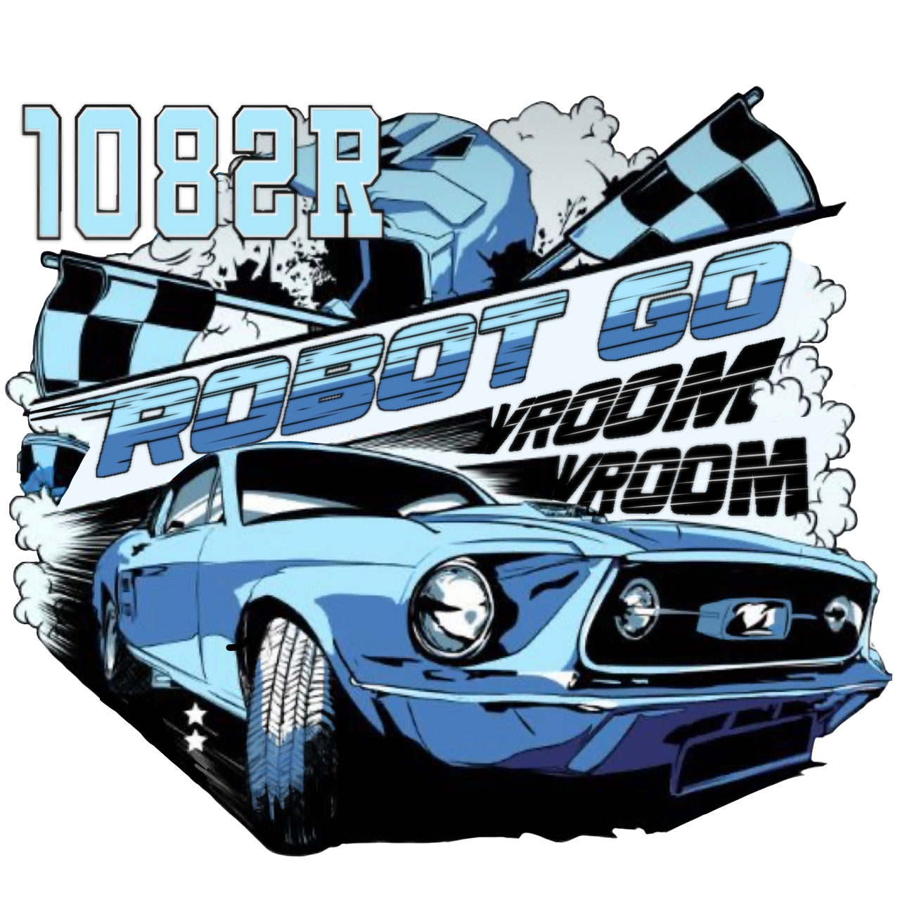
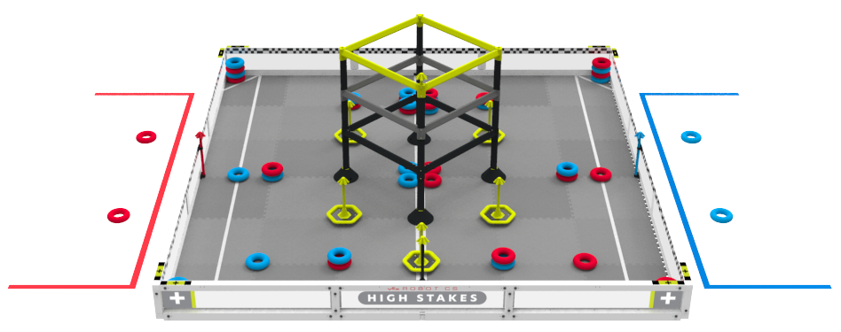

  

<h1 align="center">High Stakes</h1>

  

    VRC Team 1082R - "Robot Go Vroom Vroom"
     
    Retired HS VEX team based in Lucas, Texas
     
    Part of Lovejoy Robotics Club
     
    <a href="https://www.robotevents.com/teams/VRC/1082R">RobotEvents</a>
  

 
 
<h1 align="center">2024-2025 High Stakes Code</h1>

 

This repository contains the VEX V5 code for VRC Team 1082R, "Robot Go Vroom Vroom," for the 2024-2025 competition season, themed "High Stakes." The code is developed for a VEX V5 robot and includes various modules for robot control, motion planning, and localization.

  

## Project Structure

The project is organized into several key directories:

- `/include`: Contains header files for various modules and VEX V5 API.
- `/src`: Contains source code files for the robot's functionality.
- `/vex`: Contains VEX V5-specific build system files.
- `/Localization`: Contains headers and source files related to robot localization (Kalman Filter and MCL).
- `/Misc`: Contains headers and source files for miscellaneous utilities (Auton routines, Drawing, Matrix operations, Point structures, Spline generation).
- `/Motion`: Contains headers and source files for motion planning and control (2DMP, LadyBrown, MPC, PID).

## Key Components

### Robot Configuration

- `/include/robot-config.h`: Defines the robot's hardware configuration.
- `/src/robot-config.cpp`: Implements the robot's hardware configuration.

### Core Robot Logic

- `/src/main.cpp`: The main entry point for the robot's code.

### Localization

- `/include/Localization/Kalman.h` and `/src/Localization/Kalman.cpp`: Implementation of a Kalman Filter for state estimation.
- `/include/Localization/MCL.h` and `/src/Localization/MCL.cpp`: Implementation of Monte Carlo Localization (MCL).

### Motion Control and Planning

- This repository includes various approaches to motion control and planning, such as PID control, Model Predictive Control (MPC), and potentially custom algorithms like "LadyBrown" and "2DMP."

### Miscellaneous Utilities

- Helper functions and classes for autonomous routines, drawing on the V5 screen, matrix operations, point representations, and spline generation for smooth paths.
